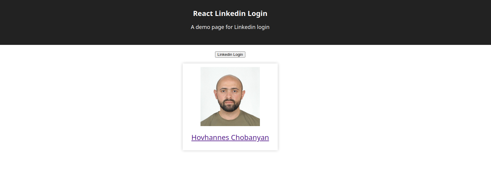

# React Linkedin Login


A simple app to demo Linkedin login using LinkedIn OAuth 2.0

## Screenshot



## Usage

### Clone

```shell
git clone https://github.com/datauser-hash/my-app.git
```

### Install Dependencies

Intall dependencies for server

```shell
cd React-Linkedin-Login
npm install
```

Install dependencies for client

```shell
cd client
npm install
```

### Get Linkedin App Credential from Linkedin Developer Portal

`https://www.linkedin.com/developers/apps/new` and add this to the page with autorithy

- client_id
- client_secret

Configure 'http://localhost:3001/callback' as Oauth2.0 redirect uri

### Create Environment Variables

/React-Linkedin-Login/.env

```shell
EXPRESS_APP_CLIENT_ID=${Your-Client-ID}
EXPRESS_APP_CLIENT_SECRET=${Your-Client-Secret}
EXPRESS_APP_REDIRECT_URI=http://localhost:3001/callback
```

/React-Linkedin-Login/client/.env

```shell
REACT_APP_CLIENT_ID=${Your-Client-ID}
REACT_APP_REDIRECT_URI=http://localhost:3001/callback
```

### Build Client

/React-Linkedin-Login/client:

```shell
npm run build
```

### Start Server

/React-Linkedin-Login/:

```shell
PORT=3001 npm start
```
